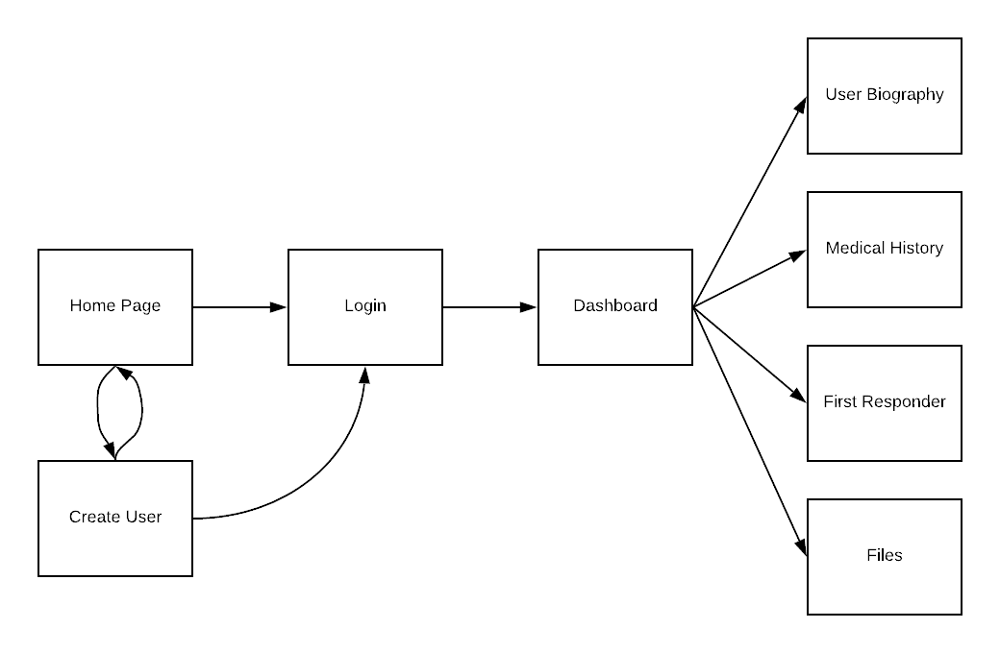
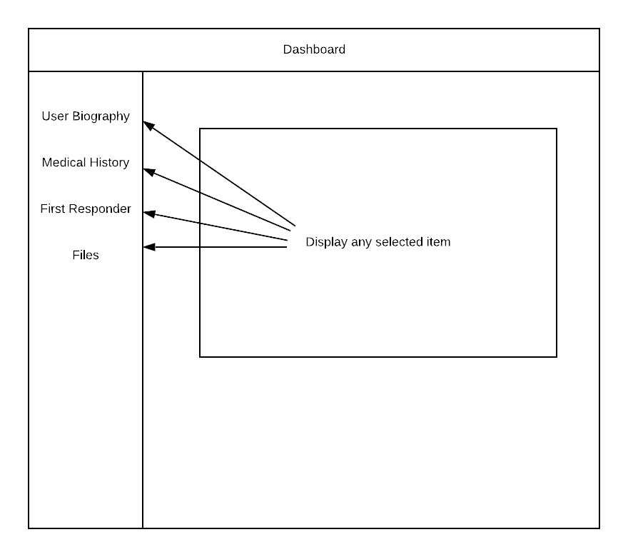

# MedInfo 

MedInfo is a dossier of your medical history. Why it would be beneficial to track your medical information is to keep it ready for
any medical situation. Whether it is a physical check up with a new doctor. Having that information at hand will help the doctor 
understand what you've been through to properly diagnose you medicine in the future. Or a first responder attending to your needs in 
a car accident. If you've been badly hurt, you don't want to be given any drugs that you may be alergic to which could be life 
threatening without the first responders knowing whats wrong. Every user is given a first-responder QR code. Any smart phone can scan 
the QR code and be brought to your list of allergies. This enables a quick check for proper diagnosis. This can hopefully save lives.

MedInfo can be used for a convenience factor or emergency situation. Confidentiality is crucial for private security. Data won't identify
any singular user. 

## Client Side Design

  

 

The user has two options upon reaching the home screen. The user can either create a profile or login. Upon creating a profile. The user is 
allowed to login. During user creation, a unique QR code is created to route to their list of allergies. This QR code can be accessed via 
the User Biography page. From the user login they are interfaced with a Dashboard as seen in the image below. The Dashboard is the center of 
the rest of the user experience. From there, the user can access and view Medical History. This is where the user can post new medical information,
edit and delete older posts. User Biography contains general information who the person is name and age. First Responder shows a list of the users 
allergy history. Files contains any files like x-ray scans, documents on medical information. Which would be downloadable from a secure user.

  

 

## Server Side Design

